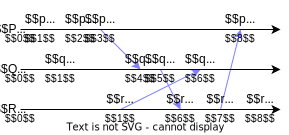

<!-- _class: title -->
<!-- paginate: true -->
# 適応的分散アルゴリズム 第２章 基礎的概念

川染翔吾

---
<!-- _class: title -->
# 2.1 分散システムのモデル

---
# 分散システム
- **分散システム**は**プロセス**の集合
- プロセスは逐次プログラムの実行インスタンス
- 本書ではプロセスを逐次アルゴリズムと同一視
- 各プロセスで動く逐次アルゴリズムの集合が**分散アルゴリズム**
- プロセスは固有の識別子を持つと仮定

---
- プロセスが実行される環境は一般には同質ではない
- 特に実行速度はによって違うと想定
- デッドロック検知問題などのために同期的実行が必要

---
# 局所時計
- 各プロセスはそれぞれ**局所時計**を持つ
- 局所時計は自律的に増加する局所変数
- 必ずしも正確に時を刻むとは限らない

# 通信機構
- プロセス同士が情報を交換するための通信機構として**共有変数**と**メッセージ伝達**がある

---
# 共有変数モデル
- 各プロセスは二つの基本通信命令 Read と Write によって共有変数に対する読み書きを行う
- プロセス $P$ が書込み権限を有する共有変数を $x$、$u$ を $P$ の局所変数とするとき、$\mathrm{Write}(x, u)$ は $u$ の値を $x$ に代入する
- プロセス $Q$ が読出し権限を有する共有変数を $x$、$v$ を $Q$ の局所変数とするとき、$\mathrm{Read}(x, v)$ は $x$ の値を $v$ に代入する
- Write 命令や Read 命令の実行にはアクセス時間がかかる

---
# 操作が同時に行われたとき
- 複数のプロセスが同時に値を読み出すとした場合、読出しはすべて正しく完了すると仮定
- 複数のプロセスが同時に値を書き込もうとした場合、以下のような結果が想定されるが、任意の一つのプロセスの書込みだけが成功すると仮定
1. すべてのプロセスの書込みが失敗する
1. すべてのプロセスが同じ値を書き込むときだけ成功する
1. 最小の識別子を持つプロセスの書込みだけが成功する
1. 任意の一つのプロセスの書込みだけが成功する

---
# メッセージ伝達モデル
- プロセス間通信のための（単方向）**通信リンク**の集合が指定される
- プロセス $P$ からプロセス $Q$ への通信リンクが存在するとき、$Q$ には $P$ からのメッセージを一時的に格納する入力バッファ（キュー）$B$ が用意されている
- 基本通信命令は Send と Receive
- $P$ が $\mathrm{Send}(Q, u)$ を実行すると、$P$ の局所変数 $u$ に格納されているメッセージ $m$ が $B$ の最後尾に挿入される
- $Q$ が $\mathrm{Receive}(P, v)$ を実行すると、$B$ の**先頭**のメッセージが $B$ から取り除かれ、$v$ に移される

---
- Send と Receive の実行には時間がかかる
- Send の実行が開始されてからメッセージが入力バッファに格納されるまでの時間を**通信遅延**と呼ぶ
- 通信遅延は内部計算の時間に比べて非常に大きい

---
# 通信におけるブロッキング
- 本書の Send 命令は**非ブロッキングSend**
- **非ブロッキングSend**：メッセージを通信リンクに送出すると直ちに終了する
- **ブロッキングSend**：対応する Receive 命令の実行が可能になるまで待たされ、状況が整うと直ちにメッセージ転送が起こる
- **非ブロッキングReceive**：入力バッファが空のとき、直ちに終了する
- **ブロッキングReceive**：入力バッファが空のとき、入力バッファにメッセージが到着するまで待たされる

---
# 通信ネットワーク
- プロセスの集合を $\Pi$、通信リンクの集合を $E$ とするとき、有向グラフ $G = (\Pi, E)$ を**通信ネットワーク**あるいは通信トポロジーなどと呼ぶ
- $P$ と $Q$ の間の通信リンクが $P$ と $Q$ 間の双方向メッセージ交換をサポートしている場合には、この通信リンクを双方向通信リンクと呼ぶ
- 直接にメッセージを送信できるのは、ある変数を共有するプロセス間あるいは通信リンクが存在するプロセス間に限られる

---
<!-- _class: title -->
# 2.2 同期モデル

---
# 同期システム
- 同期にかかわる要因は以下の3つ
1. プロセスの実行速度
1. 局所時計の正確さ
1. 通信にかかる通信遅延
- 次の3条件を満たすシステムを**同期システム**と呼ぶ
1. すべてのプロセスの実行速度は既知の定数である
1. すべての局所時計は同じ時刻、大域時刻を指している
1. すべての通信遅延は既知の定数である

---
# 同期システム
- 同期システムではプロセスの実行を**ラウンド**の系列と見做すことが多い
- 一つのラウンドは以下の流れ
    1. 複数のプロセスへメッセージを送信
    1. 複数のプロセスからメッセージを受信
    1. 内部状態を変更
- 各プロセスの実行は同期的、すなわち同時刻に各ラウンドの実行を開始
- $P$ から $Q$ へのメッセージの（直接）送信が可能ならば、あるラウンドに $P$ が $Q$ に送信したメッセージは同じラウンドにQが受信できる

---
# 非同期システム
- 同期システムではないシステムを**非同期システム**と呼ぶ
- 現実の分散システムはすべて非同期システム
- 以下の3条件を満たすシステムを**完全非同期システム**と呼ぶ
1. プロセスの実行速度についてどのような仮定も設けない
1. 局所時計の指す時刻についてどのような仮定も設けない
1. 通信遅延は有限であることを除いてどのような仮定も設けない

---
# プロセスの実行速度
- **公平**：あるプロセスがある命令を実行しようとしたときに、有限時間内にその命令が実行される
- 通常は公平であることが仮定される
- 公平性の概念は単一計算機上のマルチプログラミングの理解から現れた
- 複数の計算機システムにまたがる分散システムはさまざまな理由からプロセスにおける各命令の実行時間が決まる
- **デーモン**によって抽象化

---
# デーモン
- **デーモン**：各時刻においてデーモンは実行可能なプロセス集合から実際に実行するプロセスを選択するスケジューラ
- 分散アルゴリズムの設計では通常はデーモンを**敵対者**として扱い、最悪のデーモンに対してもうまく働く分散アルゴリズムを設計しようとする
- **集中型デーモン**：常に最大1個のプロセスを選択するデーモン
- **分散型デーモン**：上の制約を外したデーモン
- デーモンの公平性：任意の実行可能なプロセスを有限時間内に選択する
- 本書では言及がなければ公平な分散型デーモンを仮定

---
# 局所時計
### プロセスの実行速度と通信遅延が既知の定数のとき
- ある事前に決めたプロセスがその局所時計が指す時刻をある一定の周期で他のすべてのプロセスに送信することによって、すべてのプロセスの局所時計がおおよそ同じ時刻を指すようにすることができる
### 完全非同期システムのとき
- 同期問題を解く分散アルゴリズムが存在しない
- このときでも実現可能な時計の機能を実現する**論理時計**について後で説明する

---
# 通信リンク
### 通信リンクの中を流れるメッセージ
- すでに送信されたが入力バッファに格納されていない
- 現実のネットワークでは上限が存在する
- 上限を設定するモデルでは、上を超えて通信リンクに投入されたメッセージは単に消滅する
- 本書では上限が無いと仮定
### 順序
- 本書ではFIFO型を仮定

---
<!-- _class: title -->
# 2.3 故障モデル

---
# 故障
- 通信故障としてメッセージの**脱落**や**複製**がよく考慮される
- **一時故障**：たまに起こる故障。**脱落**や**複製**など
- 一時的でない脱落故障はプロセス間のメッセージ通信が完全に途絶える。**ネットワーク分割**
- **停止故障**：プロセスは停止し、再起動することはない
- 通信遅延に上限がないとき、プロセスが停止故障しているのか、単に通信遅延が大きいだけなのか判断できない
- **ビサンチン故障**：最悪の振舞いをする。周りのプロセスを欺くような振舞い。

---
<!-- _class: title -->
# 2.4 前後関係、論理時計、無矛盾大域状態

---
# 前後関係
- 時間の役割はおおよそ以下の二つ。今回は前者に注目
    - 二つの事象が生起した順序を定める
    - 二つの事象の生起した間隔を測る
- プロセス $P$ の実行過程を事象の系列 $e_1,e_2,\dots$ としてモデル化する。$e_i$ はある命令が実行されるという事象。
- $\mathcal{S}$：二つのプロセス $P, Q$ から構成される分散システム
- $\mathcal{S}$ に生起する事象の集合 ${e_i, f_i\colon i\ge1}$ の間に確定的に存在する生起順序を考える

---
- 同一プロセスに属する事象の生起順序関係およびメッセージの送受信から決まる生起順序関係と両立する事象集合上の最弱の半順序関係を**前後関係**と呼ぶ
- 前後関係 $\to$ を下のように正確に定義する

1. 事象 $e_1$ と $e_2$ が同じプロセスの事象ならば、$e_1$ が $e_2$ より先に生起したときかつそのときに限り、 $e_1\to e_2$
1. 事象 $e_1$ と事象 $e_2$ がある同一のメッセージの送信および受信事象であれば $e_1 \to e_2$
1. 事象 $e_1, e_2$ および $e_3$ に関して $e_1 \to e_2$ かつ $e_2 \to e_3$ ならば $e_1 \to e_3$

---
# 論理時計
- 前後関係と矛盾しない時計を**論理時計**と呼ぶ
- プロセス $P$ の時計 $C_P$ で計った $P$ の事象 $e$ が生起した時を $C_P (e)$ で表現する
- 事象 $e$ がプロセス $P$ の事象ならば $C(e) = C_P (e)$ と定義することで、大域時計 $C$ を定義する
- $C$ は時計条件「$e_1 \to e_2$ ならば $C(e_1) < C(e_2)$」を満たすとき論理時計であるという

---
# 論理時計の実現
- プロセス $P$ は変数 $C_P$ を局所時計として用意する
- $C_P$ の初期値は $0$
- $C_P$ は以下の規則に従って、$P$ に事象が生起するたびに更新する
通信事象以外：通信事象以外の事象 $e$ が $P$ で生起したならば、$C_P \gets C_P + 1$ を実行
送信事象：送信事象 $e$ が $P$ で生起したならば、$C_P \gets C_P + 1$ を実行。ただし $P$ が送信するメッセージには**時刻印** $ts = C_P$ を添付する
受信事象：時刻印 $ts$ を持つメッセージを受信する受信事象 $e$ が $P$ で生起したならば、$C_P \gets \max(ts, C_P) + 1$ を実行

---
# 例
- 三つのプロセス $P, Q, R$ から構成されるシステム
- $P$ で生起した事象は $p_1, p_2, p_3, p_4$
- $Q$ で生起した事象は $p_1, p_2, p_3, p_4$
- $R$ で生起した事象は $p_1, p_2, p_3, p_4$
- 四つのメッセージが送信され、それぞれの送受信事象の組は $(p_3, q_2), (r_1, q_4), (q_3, r_2), (r_3, p_4)$

---
# 時空ダイアグラム

---
# 時空ダイアグラム
- 図は**時空ダイアグラム**
- 各水平線（**プロセス線**）はプロセスの時間経過
- 右に向けて実時間が流れる
- 二つのプロセス線をまたぐ有向線は**メッセージ線**
- $p \to q$ であることと、時空ダイアグラムで $p$ から $q$ プロセス線とメッセージ線を右に辿ることで到達できることとが等価

---
- システムの動作に出現する事象の全集合を $\mathcal{E}$ とする
- $\mathcal{E}$ は $t$ 以前に実行が終了した事象の集合 $\mathcal{P}$ とこれから実行が行われる事象の集合 $\mathcal{F}$ に分割でき、この分割が $t$ におけるシステムの大域状態を決定する
- 分割 $\mathcal{P} = \{p_1, p_2, q_1\}, \mathcal{F} = \{p_3, p_4, q_2, q_3, q_4, r_1, r_2, r_3, r_4\}$ は事象の過去と未来への分割
- 分割 $\mathcal{P}' = \{p_1, p_2\}, \mathcal{F}' = \{p_3, p_4, q_1, q_2, q_3, q_4, r_1, r_2, r_3, r_4\}$ に対応する実時刻は存在しない
- 分割 $(\mathcal{P}', \mathcal{F}')$ に対応する大域状態はシステムにとって「生起していた可能性が否定できない大域状態」の一つ

---
# 大域スナップショット
- 前後関係と矛盾しないことを**無矛盾**と定義
厳密には、任意の$e \in \mathcal{P}, f \in \mathcal{F}$ に対して、$f \nrightarrow e$ が成立する
- **大域スナップショット**と：無矛盾な大域状態を構成すること
- **ロールバックリカバリ**：分散システムに故障が発見されたとき、故障する以前の無矛盾な大域状態にシステムの状態を戻し、故障から回復すること