<!-- _class: title -->
<!-- paginate: true -->
# 適応的分散アルゴリズム 第３章 分散システムの安定性

川染翔吾

---
<!-- _class: title -->
# 3.1 送信

---
# 送信

プロセス $P$ がプロセス $Q$ に情報 $m$ を**確実**に伝えたい場合について考える

### 条件
- プロセス $P$ とプロセス $Q$ の間には通信リンク $l$ がある
- 通信リンク $l$ で脱落故障が起こる
    - ただし、脱落故障は一時故障であり、すべてのメッセージが消失するわけではない

---

# 自明なアルゴリズム

1. $P$ が $m$ を繰返し $Q$ に送信する

- $Q$ はいつかは確実に受信できる
    - 仮定から、すべてのメッセージが脱落することはない
- $P$ は送信をいつまでも続ける必要がある
    - 適当な回数で止めることにすると、それまでのメッセージがすべてたまたま脱落した場合はメッセージを伝えられない

---
# 停止するアルゴリズム
$Q$ が $m$ を受け取ったことを $P$ が知るためには、$Q$ がその事実を $P$ に伝える必要がある

### アルゴリズム
1. $P$ が $m$ を繰返し $Q$ に送信する
1. $Q$ は $m$ を受信すると $A_Q(m)$ を $P$ に繰返し送信する
1. $P$ は $A_Q(m)$ を受信すると、$m$ の送信を終了する
- $P$ はいつかは確実に終了する
- $Q$ はいつまでも送信を続ける

---
# 両プロセスが停止するアルゴリズム

プロセスが終了すると仮定

最後に送信するメッセージについて、これが脱落しても、もう一方のプロセスは終了できる。すなわち最後のメッセージは送信する必要がないことになり、矛盾。

### 定理

メッセージの脱落故障に耐え、両プロセスが停止する送信アルゴリズムは存在しない

---
<!-- _class: title -->
# 3.2 放送

---
# 放送
- **放送**：あるプロセス（発信者）$P$ が持つ情報 $m$ を $P$ を含むすべてのプロセスに伝えること

### 条件
- 通信ネットワークは完全グラフ
    - 任意の2つのプロセス間に通信リンクがある
- 停止故障を想定する

---
### 分散システムが正常なとき
$P$ はシステムに属するすべてのプロセス $Q$ に対して $m$ を順番に送信する

### 停止故障が起きるとき
「$P$ はシステムに属するすべてのプロセス $Q$ に対して $m$ を順番に送信する」というアルゴリズムだと、$P$ が途中で故障したとき、うまくいかない

---
# 放送アルゴリズム
## 基本通信命令
- Broadcast：放送する
- Deliver：受信命令。「引渡す」の意

---
# なぜ受信が Deliver なのか
### 上位レイヤ
Broadcastで放送し、Deliverが呼ばれたとき受信時の処理をする。

### 下位レイヤ
再送処理や重複除去などをし、適切にメッセージを上位レイヤに引渡す。

これから考える耐故障放送アルゴリズムは下位レイヤの動作。
故障を隠蔽し、上位レイヤからの操作を単純にする。

---
# 耐故障放送アルゴリズムの性質

**妥当性**：ある正常プロセス $P$ が $\mathrm{Broadcast}(m)$ を実行したならば、$P$ はいつかは $\mathrm{Deliver}(m)$ を実行する
**合意性**：ある正常プロセス $P$ が $\mathrm{Deliver}(m)$ を実行するならば、すべての正常プロセスもいつかは $\mathrm{Deliver}(m)$ を実行する
**整合性**：どのメッセージ $m$ についても、 $\mathrm{Deliver}(m)$ を複数回実行するプロセスは存在せず、しかも $\mathrm{Deliver}(m)$ が実行されるのは対応する $\mathrm{Broadcast}(m)$ が事前に実行されているときに限る

---
# R-BROADCAST
### $\mathrm{Broadcast}(m)$ の実現
1. $m$ を自分を含めてすべてのプロセスに送信する

### $m$ を受信したプロセス $P$ の対応
1. 初めて $m$ を受信したときに限り以下の2命令を実行する
    1. $P\neq\mathrm{sender}(m)$ ならば $m$ をすべてのプロセスに送信する
    1. $\mathrm{Deliver}(m)$ を実行する

$\mathrm{sender}(m)$：メッセージ $m$ を放送しようとしている発信者

---
# R-BROADCASTのシミュレーション

$P$ が他の3個のプロセス $Q, R, S$ に対して R-BROADCAST を用いて放送を行う

---
# シミュレーション 1

- すべてのプロセスが正常

---
# シミュレーション 1

---
# シミュレーション 1

---
# シミュレーション 2

- $P$ は $P, Q$ に $m$ を送信したあと故障
- $Q$ は $Q, R$ に $m$ を送信したあと故障

---
# シミュレーション 2

---
# シミュレーション 2

---
# シミュレーション 2

---
# シミュレーション 2

---
# R-BROADCAST

### 定理

R-BROADCASTは妥当性、合意性、整合性の条件を満たす耐停止故障放送アルゴリズムである

### 証明

**妥当性**
正常プロセス $P$ が $\mathrm{Broadcast}(m)$ を実行すると、$P$ は $m$ をいつかは受信し、$\mathrm{Deliver}(m)$ を実行する。

---
**合意性**
ある正常プロセス $P$ が $\mathrm{Deliver}(m)$ をしたとする。
- $P$ が $\mathrm{sender}(m)$ の場合
$P$ は $m$ をすでにすべてのプロセスに送信している。
- $P$ が $\mathrm{sender}(m)$ でない場合
$P$ は $m$ を受信しており、初めて $m$ を受信したときに $m$ をすべてのプロセスに送信している。

いずれの場合もすべての正常プロセスはいつかは $m$ を受信し、 $\mathrm{Deliver}(m)$ を実行する。

---
**整合性**
$\mathrm{Deliver}(m)$ の実行は初めて $m$ を受信したときに限られる。また、$\mathrm{Broadcast}(m)$ が $\mathrm{sender}(m)$ によって実行されていないにもかかわらず $\mathrm{Deliver}(m)$ が実行されたと仮定すれば、容易に矛盾を導くことができる。