<!-- _class: title -->
<!-- paginate: true -->
# 適応的分散アルゴリズム 第３章 分散システムの安定性

川染翔吾

---
<!-- _class: title -->
# 3.3 合意

---
# 一様合意問題

$B$：初期値の全集合
各プロセス $P_i$ は局所変数 $d_{P_i}$, $w_{P_i}$ を持つ
- $d_{P_i}$：初期値
- $w_{P_i}$：合意値

各プロセス $P_i$ は変数 $w_{P_i}$ にちょうど1回だけある値 ($\in B$) を代入する

**一様合意性**：すべてのプロセス $P_i$ は、合意値を持つならば、同じ値を合意値として持つ
**停止性**：すべての正常プロセス $P_i$ はいつかは合意値を決定する
**妥当性**：合意値は常にあるプロセスの初期値から選択される

---
# 故障が起こらない場合
1. 各プロセス $P$ が $d_P$ を放送する
    - 各プロセス $P$ はすべてのプロセスの初期値の集合 $D$ を知ることが出来る
1. $w_P$ に $\min{D}$ を代入する
    - 事前に $B$ に全順序を導入しておく

明示しない場合、放送は単にすべてのプロセスに一度ずつ送信することを指す

---
# 停止故障が起こりうる場合

### 条件
- 同期システム
- 通信ネットワークは完全グラフ
    - 任意の2つのプロセス間に通信リンクがある

---
# 同期システム
- プロセスの実行を**ラウンド**の系列と見做す
- 一つのラウンドは以下の流れ
    1. 複数のプロセスへメッセージを送信
    1. 複数のプロセスからメッセージを受信
    1. 内部状態を変更
- 各プロセスの実行は同期的、すなわち同時刻に各ラウンドの実行を開始
- $P$ から $Q$ へのメッセージの（直接）送信が可能ならば、あるラウンドに $P$ が $Q$ に送信したメッセージは同じラウンドに $Q$ が受信できる

---
# CONS1
プロセス $P$ 上のアルゴリズム
- ラウンド $1$
    1. 初期値 $d_P$ を送信する
    1. 受信した初期値 $d_Q$ の集合を $D_P$ とする
    1. $w_P \gets \min{D_P}$

「故障はラウンドの途中で起こらない」と仮定すると正しい

ラウンドの途中（特に放送の途中）で故障が起こる場合は？

---
# シミュレーション

---
# シミュレーション

---
# シミュレーション

---
# CONS2
プロセス $P$ 上のアルゴリズム
- ラウンド $1$
    1. 初期値 $d_P$ を送信する
    1. 受信した初期値 $d_Q$ の集合を $D_P$ とする
- ラウンド $2$
    1. $D_P$ を送信する
    1. 受信した $D_Q$ の集合を $\mathcal{D}_P$ とする
    1. $w_P \gets \min{\bigcup_{D_Q \in \mathcal{D}_P} D_Q}$

---
# シミュレーション 1

---
# シミュレーション 1

---
# シミュレーション 1

---
# シミュレーション 2

---
# シミュレーション 2

---
# シミュレーション 2

---
# CRASH-CONS(f)
プロセス $P$ 上のアルゴリズム
- ラウンド $1$
    1. 初期値 $d_P$ を送信する
    1. 受信した初期値 $d_Q$ の集合を $D_P$ とする
- ラウンド $r$ $(2\le r\le f+1)$
    1. $D_P$ を送信する
    1. 受信した $D_Q$ の集合を $\mathcal{D}_P$ とする
    1. $D_P \gets \bigcup_{D \in \mathcal{D}_P} D$
    1. $r=f+1$ のとき $w_P \gets \min{D_P}$

---
# CRASH-CONS(f)
### 定理
CRASH-CONS(f) は同期システム上の耐 $f$ プロセス停止故障一様合意アルゴリズムである
### 証明
ある正常プロセスが $f+2$ ラウンド以降に新しい情報を得ることはないことを証明する。

ある正常プロセス $P$ があるプロセス $Q$ の初期値 $d_Q$ をラウンド $f+2$ に初めて獲得したと仮定する。
ラウンド $r$ に初めて $d_Q$ を獲得したプロセスの集合を $\Pi_r$ とする。($Q$ は $\Pi_1$ に入れない)
定義から任意の $r\ne r'$ に対して、$\Pi_r \cap \Pi_{r'} = \emptyset$

---
任意の $1\le r\le f$ に対して、$\Pi_r \ne \emptyset$ であることを示す。

$P$ はラウンド $f+2$ まで $d_Q$ を獲得できないので、ラウンド $r$ が開始されるまでに $d_Q$ を知っているプロセスはラウンド $r$ が終了する以前に故障している。したがって、$\Pi_r = \emptyset$ ならば、ラウンド $r+1$ では $d_Q$ を知っているプロセスはすべて故障していることになり矛盾。

任意の $1\le r\le f$ に対して、$\Pi_r$ は故障プロセスの集合であり、さらに $Q$ は故障プロセスであることから、故障プロセス数は少なくとも $f+1$ となり矛盾。

---
# 無待機アルゴリズム
**無待機アルゴリズム**：最大 $n-1$ 個のプロセス停止故障が発生しても動作が保証できるようなアルゴリズム

---
<!-- _class: title -->
# 3.4 コミット

---
# コミット問題
**コミット問題**：すべての正常プロセスが更新に賛成のときだけ値 commit で合意できるようにする問題

初期値の全集合 $B=\{\mathrm{yes}, \mathrm{no}\}$
各プロセス $P_i$ は変数 $w_{P_i}$ にちょうど1回だけある値$\in\{\mathrm{commit}, \mathrm{abort}\}$ を代入する

---
# コミット問題
**一様合意性**
すべてのプロセス $P_i$ は、合意値を持つならば、同じ値を合意値として持つ
**弱停止性**
故障が起こらなければすべての正常プロセス $P_i$ はいつかは合意値を決定する
**妥当性**
1. $\mathrm{no}$ を初期値とするプロセスが存在するとき、合意値は $\mathrm{abort}$ でなければならない
1. すべてのプロセスが初期値 $\mathrm{yes}$ を持ち、かつ故障が起こらなければ、合意値は $\mathrm{commit}$ でなければならない

---
# 2P-COMMIT (two phase commit algorithm)
プロセス $P_0$ 上のアルゴリズム
- ラウンド $1$
    1. システムの初期値がすべて $\mathrm{yes}$ なら $w_{P_0} \gets \mathrm{commit}$
    そうでなければ $w_{P_0} \gets \mathrm{abort}$
- ラウンド $2$
    1. $w_{P_0}$ を放送する

---
# 2P-COMMIT (two phase commit algorithm)
プロセス $P(\ne P_0)$ 上のアルゴリズム
- ラウンド $1$
    1. 初期値 $d_P$ を $P_0$ に送信する
    1. $d_P=\mathrm{no}$ なら $w_P \gets \mathrm{abort}$
- ラウンド $2$
    1. $w_{P_0}$ を受信したとき、$d_P=\mathrm{yes}$ なら $w_P \gets w_{P_0}$

---
# 2P-COMMIT (two phase commit algorithm)
### 定理
2P-COMMIT はコミット問題に対する正しいアルゴリズムである

### 証明
$P_0$ が故障しないならば、すべての正常プロセスが合意値を決定し、アルゴリズムの定義から合意性と妥当性を満たす。
$P_0$ が故障する場合には、$d_P=\mathrm{no}$ であるプロセス $P$ だけが合意値 $\mathrm{abort}$ を決定するので、明らかに合意値と妥当性を満たす。

---
# 非ブロッキングコミット問題
**一様合意性**
すべてのプロセス $P_i$ は、合意値を持つならば、同じ値を合意値として持つ
**停止性**
すべての正常プロセス $P_i$ はいつかは合意値を決定する
**妥当性**
1. $\mathrm{no}$ を初期値とするプロセスが存在するとき、合意値は $\mathrm{abort}$ でなければならない
1. すべてのプロセスが初期値 $\mathrm{yes}$ を持ち、かつ故障が起こらなければ、合意値は $\mathrm{commit}$ でなければならない

---
<!-- _class: title -->
# 3.5 相互排除

---
# 相互排除
最も簡単なアクセス制御方法は、各資源の管理をするプロセス（サーバ）を用意すること。それ以外のプロセス（クライアント）はサーバにアクセス要求を送り、サーバは適切なクライアントを選び、アクセスを許可する。

**段階的退化**：局所的な故障が分散システム全体に壊滅的な故障を引き起こすことがないこと

---
# 多数決合意
プロセスの集合：$\Pi=\{P_0,P_1,\dots,P_{n-1}\}$
$M=\lceil \frac{n+1}{2} \rceil$

各プロセス $P_i$ は変数 $\mathrm{vote}_{P_i}$ とキュー $\mathrm{wait}_{P_i}$ を持つ 
$\mathrm{vote}_{P_i}$ の初期値は $\bot$
$\mathrm{wait}_{P_i}$ の初期値は $\emptyset$

---
# MAJ-CONS
$P_i$ 上のアルゴリズム
- 資源 $R$ へのアクセスを希望するとき
    1. メッセージ $\mathrm{Request}(i)$ を放送する
    1. $M$ 個以上のプロセス $P_j$ からメッセージ $\mathrm{Perm}(j)$ が届くのを待つ
    1. $R$ へのアクセスを開始する
---
- 資源 $R$ へのアクセスを終了したとき
    1. これまでに受信した $\mathrm{Perm}(j)$ を送信したプロセス $P_j$ の集合を $\mathrm{PERM}$ とする
    1. $\mathrm{PERM}$ に属するすべてのプロセス $P_j$ にメッセージ $\mathrm{Release}(i)$ を送信する
- メッセージ $\mathrm{Request}(j)$ を受信したとき
    1. $\mathrm{vote}_{P_i}\ne\bot$ のとき
        - $P_j$ を $\mathrm{wait}_{P_i}$ に挿入する
    1. $\mathrm{vote}_{P_i}=\bot$ のとき
        - メッセージ $\mathrm{Perm}(i)$ を $P_j$ に送信する
        - $\mathrm{vote}_{P_i} \gets P_j$
---
- メッセージ $\mathrm{Release}(j)$ を受信したとき
    1. $\mathrm{wait}_{P_i}\ne\emptyset$ のとき
        - $\mathrm{wait}_{P_i}$ から最初のプロセス $P_k$ を取り出す
        - メッセージ $\mathrm{Perm}(i)$ を $P_k$ に送信する
        - $\mathrm{vote}_{P_i} \gets P_k$
    1. $\mathrm{wait}_{P_i}=\emptyset$ のとき
        - $\mathrm{vote}_{P_i} \gets \bot$

相互排除を実現できる
プロセスは最大1個のプロセスに対してそのアクセスを承認できる
デッドロックに陥る可能性がある

---
# 改良版
$P_i$ 上のアルゴリズム
- 資源 $R$ へのアクセスを希望するとき
    1. $M$ 個のプロセスの集合 $Q=\{P_{i_1},P_{i_2},\dots,P_{i_M}\} (i_1<i_2<\cdots<i_M)$ を自由に選択する
    1. $j$ を $1$ から $M$ まで繰り返す
        - $P_{i_j}$ に $\mathrm{Request}(i)$ を送信する
        - $P_{i_j}$ から $\mathrm{Perm}(i_j)$ が届くのを待つ
    1. $R$ へのアクセスを開始する

**定順要請法**：あらかじめ決められた順に承認を得る