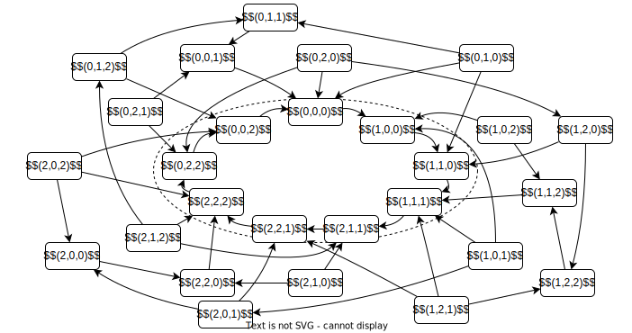
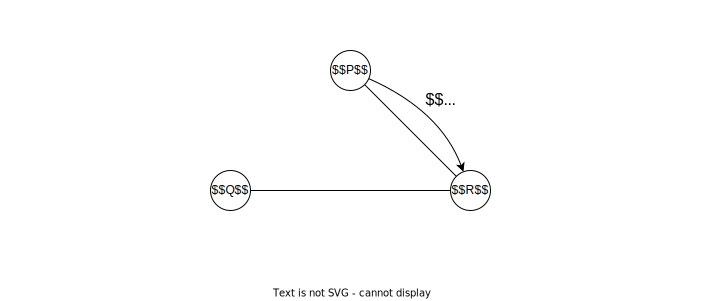
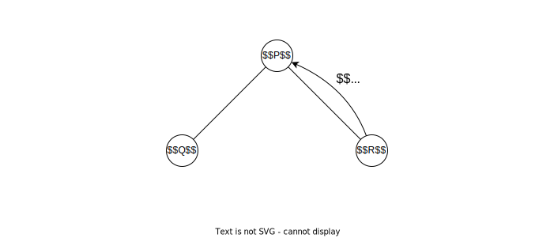

<!-- _class: title -->
<!-- paginate: true -->
# 適応的分散アルゴリズム 第３章 分散システムの安定性

川染翔吾

---
<!-- _class: title -->
# 3.6 トークン巡回

---
# トークン
- 相互排除問題を解決する別の方法
- 分散システムに属するプロセス間を**トークン**と呼ばれる特別なメッセージがちょうど $1$ 個だけ巡回するようにする
- トークンを保持している間はアクセスを許す

---
# トークン巡回
**トークンリング**：リングに沿ってトークンを巡回させることで相互排除を行うシステム

### 条件
- 通信ネットワークは**単方向リング**
    - $E = \{(P_i, P_{(i+1) \mod n})\mid 0\le i\le n - 1\}$

---
# TOKEN-RING
プロセス $P_i$ 上のアルゴリズム
1. トークンを受信したら
    - トークンをプロセス $P_{i+1}$ に送信する

- トークンリングの初期化時に $P_0$ がトークンを生成するものとする

---
# TOKEN-RING
- なんらかの故障でトークンが失われたら、回復できない
- タイムアウト機構を導入すると？
    - 通信遅延や、トークンを受信してから送信するまでの時間などの上限が既知なら、トークンの消失を感知できる
    - トークンの数が増える故障には無力

---
# SS-TOKEN-RING
プロセス $P_i$ の局所状態を $s_i \in \{0,1,\dots,K-1\}$ とする ($K$ は $n$ 以上の任意の自然数)
| プロセス $P_0$ 上のアルゴリズム | プロセス $P(\ne P_0)$ 上のアルゴリズム |
| --- | --- |
| $s_{n-1}=s_0$ なら $s_0 \gets (s_0+1) \mod K$ | $s_{i-1}\ne s_i$ なら $s_i \gets s_{i-1}$ |

---
# SS-TOKEN-RING
## $n = 3, K = 3$ の場合
$(0,0,0) \to (1,0,0) \to (1,1,0) \to (1,1,1)$
$(1,1,1) \to (2,1,1) \to (2,2,1) \to (2,2,2)$
$(2,2,2) \to (0,2,2) \to (0,0,2) \to (0,0,0)$
### 故障したとき
$(2,1,0) \to (2,2,0) \to (2,2,2)$
$(2,1,0) \to (2,1,1)$

---
# SS-TOKEN-RINGの大域状態間の推移

---
# 自己安定アルゴリズム
- 一時故障が起こっても、自動的に回復するようなアルゴリズムを**自己安定アルゴリズム**という

- SS-TOKEN-RINGは自己安定トークン巡回アルゴリズムである
    - 証明は **7.3.3**

---
<!-- _class: title -->
# 3.7 探索

---
# 探索
- 時刻 $t$ によって変化する通信ネットワーク $G_t = (V, E_t)$ で、プロセス $P \in V$ から開始してプロセス $Q \in V$ を探索する問題を考える
- $Q$ の発見に焦点を当てると、探索問題を $Q$ へある情報を伝達する問題と見做せる
- $Q$ の位置が不明
    - すべてのプロセスにある情報を伝達する、放送問題

### 条件
- 同期システム
- $G_t$ は連結無向グラフ

---
# FLOOD1
並列幅優先探索
| プロセス $P_0$ 上のアルゴリズム | プロセス $P(\ne P_0)$ 上のアルゴリズム |
| --- | --- |
| 隣接プロセスにメッセージ $m$ を放送する | `if` $m$ を初めて受信した `then` 隣接プロセスにメッセージ $m$ を放送する |

---
# FLOOD1のシミュレーション
- $V = \{P, Q, R\}$
- 始動プロセスは $P$
- $E_1 = \{(P, R), (Q, R)\}$
- $t\ge 2$ のとき $E_t = \{(P, Q), (P, R)\}$

---
# FLOOD1のシミュレーション

---
# FLOOD1のシミュレーション

---
# FLOOD1のシミュレーション
- $Q$ は $m$ を受信できない

---
# FLOOD2
| プロセス $P_0$ 上のアルゴリズム | プロセス $P(\ne P_0)$ 上のアルゴリズム |
| --- | --- |
| 時刻 $n-1$ まで 隣接プロセスにメッセージ $m$ を放送する | `if` $m$ を受信した `then` 時刻 $n-1$ まで 隣接プロセスにメッセージ $m$ を放送する |

---
# FLOOD2
### 定理
FLOOD2 は $G_t$ が動的に変化しても、同期システム上で放送問題を解くことが出来る

### 証明
$n=1$のときは自明。$n\ge 2$ で 時刻 $t (1\le t \le n-1)$ の放送を終了したとき、少なくとも $t+1$ 個のプロセスに放送が終了することを数学的帰納法で示す。

---

$t=1$ のとき、$G_1$ が連結であるため、$P_0$ の次数が $1$ 以上であり、$P_0$ が放送することで $P_0$ 以外のあるプロセスが情報を受信する。

時刻 $t-1$ のとき成り立つと仮定。
時刻 $t-1$ の終了時点で情報を受信しているプロセスの集合を $U_{t-1} (\subseteq V)$ とする。
仮定から $|U_{t-1}|\ge t$。
$|U_{t-1}|=n$ の場合、$|U_t|=n\ge t+1$。
$|U_{t-1}|<n$ の場合、$V\setminus U_{t-1}$ に含まれる任意のプロセスを $P$ とすると、$G_t$ は連結だから、$P_0$ と $P$ を結ぶ道 $\pi$ が存在する。$\pi$ を $P_0$ から辿ったときに、最初に到達する $V\setminus U_{t-1}$ に含まれるプロセスを $Q$ と置く。$\pi$ における $Q$ の直前のプロセスを $R$ とすると $R\in U_{t-1}$ である。時刻 $t$ には $Q$ は $R$ から情報を受信できるので、$Q\in U_t\setminus U_{t-1}$ すなわち、$|U_t|\ge t+1$ である。

---
# FLOOD2
- FLOOD2の通信複雑度は $O(n^3)$
    - 隣接プロセス数が $O(n)$
    - プロセスの数が $n$
    - $O(n)$ 回繰り返す

---
# RAND-SEARCH
| プロセス $P_0$ 上のアルゴリズム | プロセス $P(\ne P_0)$ 上のアルゴリズム |
| --- | --- |
| 隣接プロセスの一つを等確率で選択し、そこに $m$ を送信する `repeat` `if` $m$ を受信した `then` 隣接プロセスの一つを等確率で選択し、そこに $m$ を送信する `until` forever | `repeat` `if` $m$ を受信した `then` 隣接プロセスの一つを等確率で選択し、そこに $m$ を送信する `until` forever |

---
# RAND-SEARCH
- $Q$ に $m$ が到達すると、その事実を $P$ に伝え終了する
- メッセージ $m$ が $G_t$ の中を**乱歩** (random walk) する

### $G$ が変化しないとき
- 頂点 $u$ から $v$ に到達するまでに必要な道長の平均 (**平均初到達時間**) を $H_G(u,v)$ とする
- $H_G = \max_{u,v\in V} H_G(u,v) = O(|V||E|)$

### $G$ が変化するとき
- 第8章で扱う

---
<!-- _class: title -->
# 3.8 乱択アルゴリズム

---
# 乱択アルゴリズム

- よく知られた乱択アルゴリズムに乱択クイックソートがある

---
# 一般的なクイックソートの実装

<pre><code class="language-c">void quicksort(int arr[], int left, int right) {
    if (left >= right) return;
    int pivot = arr[right];
    int i = left;
    for (int j = left; j < right; j++) {
        if (arr[j] < pivot) {
            swap(&arr[i], &arr[j]);
            i++;
        }
    }
    swap(&arr[i], &arr[right]);
    quicksort(arr, left, i - 1);
    quicksort(arr, i + 1, right);
}
</code></pre>

---
# クイックソート
- 配列をピボットより大きいか小さいかで分割し前後にわけ、分割したものに対して再帰的にこれを適用する
- すべての入力が同じ確率で出現するなら、平均時間複雑度は $O(\log n)$
- 入力によっては、平均時間複雑度は $\Omega (n^2)$

# 乱択クイックソート
- ピボットをランダムに選ぶ
- 入力によらず、平均時間複雑度が $O(\log n)$
