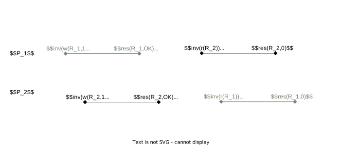

<!-- _class: title -->
<!-- paginate: true -->
# 適応的分散アルゴリズム 第６章 無待機システム

川染翔吾

---
<!-- _class: title -->
# 6.1 逐次一貫性と線形化可能性

---
# 共有メモリシステム

- **共有オブジェクト**にアクセスすることで、プロセス間通信を行う
    - 共有オブジェクトはレジスタやFIFOキューなど

- $n$ 個のプロセス $P_1,P_2,\dots,P_n$ と $m$ 個の共有オブジェクト $O_1,O_2,\dots,O_m$ から構成されるシステム

- プロセス $P$ のオブジェクト $O$ に対する操作は呼出しと応答の組で実現

1. プロセスがオブジェクトに対して操作の**呼出し**を行う
1. 操作に対する**応答**がオブジェクトからプロセスに返る

---
# 共有メモリシステム

- 呼出しから応答まではいくらかの遅延がある
- 各プロセスのオブジェクトへの操作は逐次的
    - 各プロセスは、呼出しを実行すると応答が返ってくるまで次の呼出しを実行しない

- **並行**：同じオブジェクトに対して応答が返ってくる前に別のプロセスが呼出しを実行した状態
- 複数プロセスから同一オブジェクトへの操作が並行して実行されるとき、オブジェクトの応答は何らかの**一貫性**が要求される

---
# 逐次仕様

- 逐次仕様：そのオブジェクトに対して操作を逐次的に行った場合の振舞い
- オブジェクトに対する操作の応答が一貫性を持つためには、応答が何らかの意味で逐次仕様を満たすことが要求される

### レジスタの場合
- $Write$ 命令に対しては $Write$ 命令の完了を示す応答 $OK$ を返す
- $Read$ 命令に対しては直近に書き込まれた値を応答として返す。それより前の $Write$ 命令がない場合は初期値を返す。

---
# 逐次一貫性
- **大域履歴**：プロセスの共有オブジェクトに対する操作の呼出しと応答をそれらが生じた順に並べた系列
- **プロセス履歴**：あるプロセス $P_i$ のオブジェクトへの操作履歴
    - ${inv}_i^1,{res}_i^1,{inv}_i^2,{res}_i^2,\dots$ のように呼出しとそれに対する応答が交互に現れる
- 分散システム全体の大域履歴は、各プロセスのプロセス履歴をその順序を保ちながらマージしたもの

---
# 大域履歴の例

---
# 逐次一貫性
**逐次一貫性**：各プロセスでのプロセス履歴を保ちながら大域履歴を並べ替えることによって、オブジェクトの逐次仕様を満たす系列を作れること

### 定義
分散システムの大域履歴 $H$ を並べ替えることによって、次の条件を満たす系列 $H'$ を作ることができるとき、大域履歴 $H$ は逐次一貫性を満たすという
1. $H'$ はオブジェクトに対する呼出しとその応答が交互に現れる
1. $H'$ は $P_i$ のプロセス履歴の順序を保ちながらマージしたもの
1. 各オブジェクト $O_i$ に対するすべての操作の呼出しと応答からなる $H'$ の部分系列は $O_i$ の逐次仕様を満たす

---
# 逐次一貫性を満たす例 1

---
# 逐次一貫性を満たす例 2

---
# 逐次一貫性を満たす例 3

---
# 逐次一貫性を満たす例 4

---
# 逐次一貫性を満たす例 5

---
# 逐次一貫性を満たさない例

---
# 線形化可能性
**線形化可能性**：異なるプロセスの操作であっても、その実行時間がオーバーラップしていない場合にはそれらの実行順序を保存する

### 定義
分散システムの大域履歴 $H$ を並べ替えることによって、次の条件を満たす系列 $H'$ を作ることができるとき、大域履歴 $H$ は線形化可能性を満たすという
1~3. 逐次一貫性と同じ 
4. $H$ において、操作 ${op}_1$ の応答の後に操作 ${op}_2$ の呼出しが実行されたとき、$H'$ においても操作 ${op}_1$ の応答が操作 ${op}_2$ の呼出しより前に現れる

---
# 逐次一貫性を満たすが線形化可能性を満たさない例 1

---
# 逐次一貫性を満たすが線形化可能性を満たさない例 2

---
# 線形化ポイント

**線形化ポイント**：あるオブジェクトに対する操作の呼出しと応答の間にある瞬間

次の条件を満たすように線形化ポイントを設定できるとき、$H$ は線形化可能である

- $H$ に現れるすべての操作を線形化ポイントの順に並べ替えた操作系列を $H'$ とする。このとき、各オブジェクト $O$ について、$O$ に対するすべての操作からなる $H'$ の部分系列が $O$ の逐次仕様を満たす。

これは先の線形化可能性の定義と同値

---
# 線形化ポイントの例

---
# 線形化ポイントの例

---
# 線形化ポイントの例

---
# 局所性
- 各オブジェクトに対して、大域履歴に現れるすべての操作の呼出しと応答からなる部分系列が線形化可能なら、分散システム全体の大域履歴も線形化可能である
- 上のような性質が**局所性**
- 線形化可能性を満たす分散システムを実現するには、各オブジェクトに対して線形化可能性を満たす実現を提供すれば十分

- 逐次一貫性に対しては局所性は成り立たない

---
# 逐次一貫性に関して局所性が成り立たない例

---
# 逐次一貫性に関して局所性が成り立たない例

---
# 逐次一貫性に関して局所性が成り立たない例

