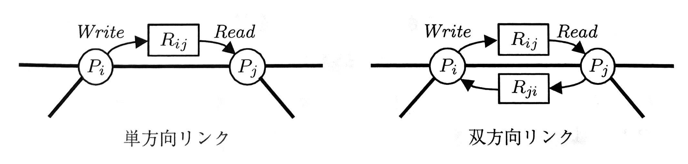
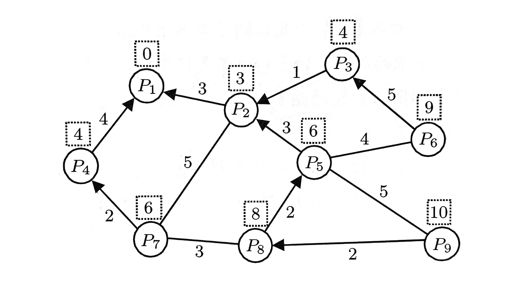
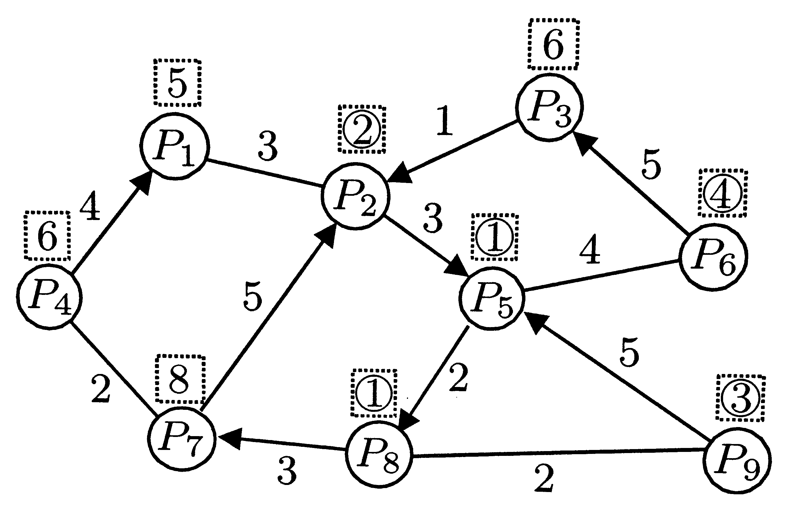
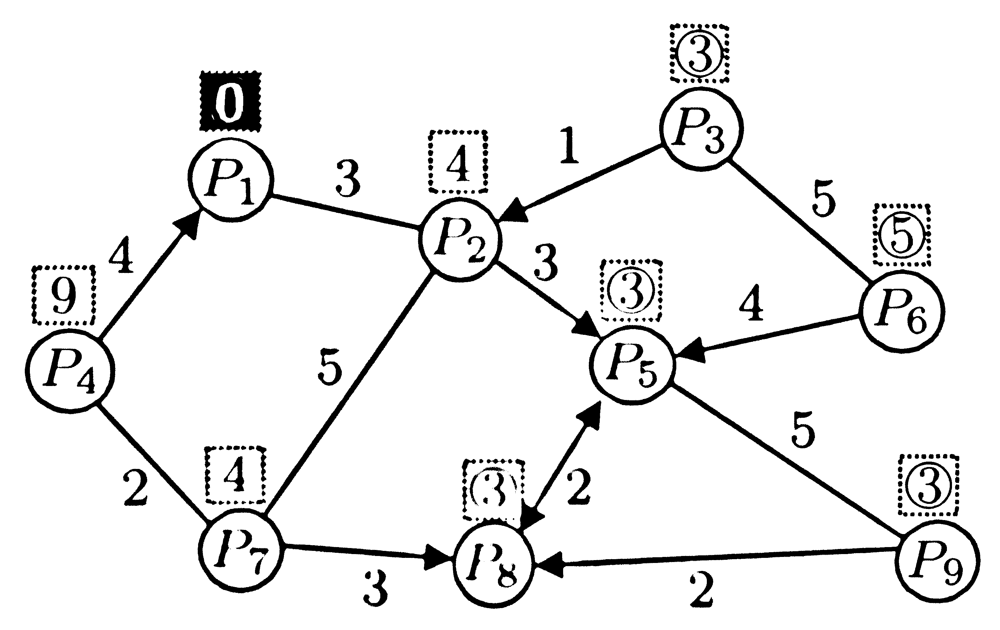
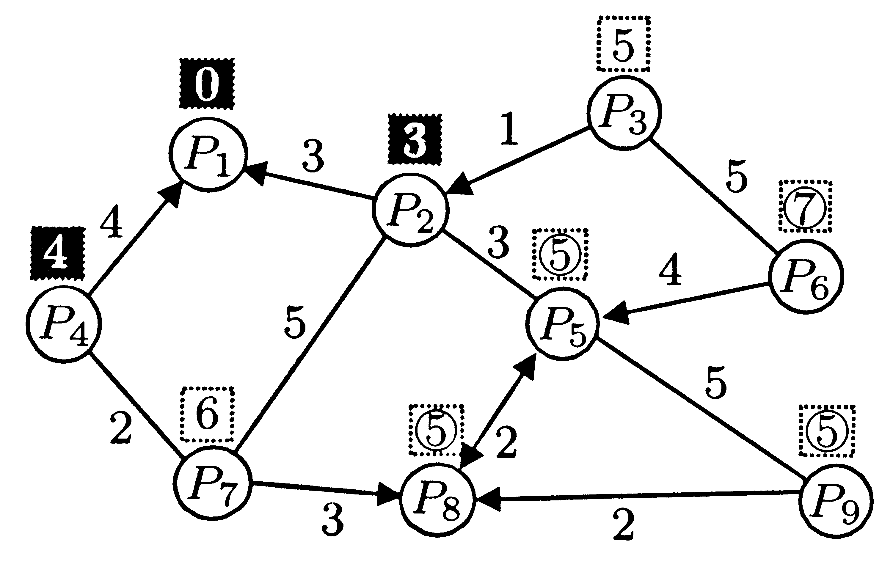
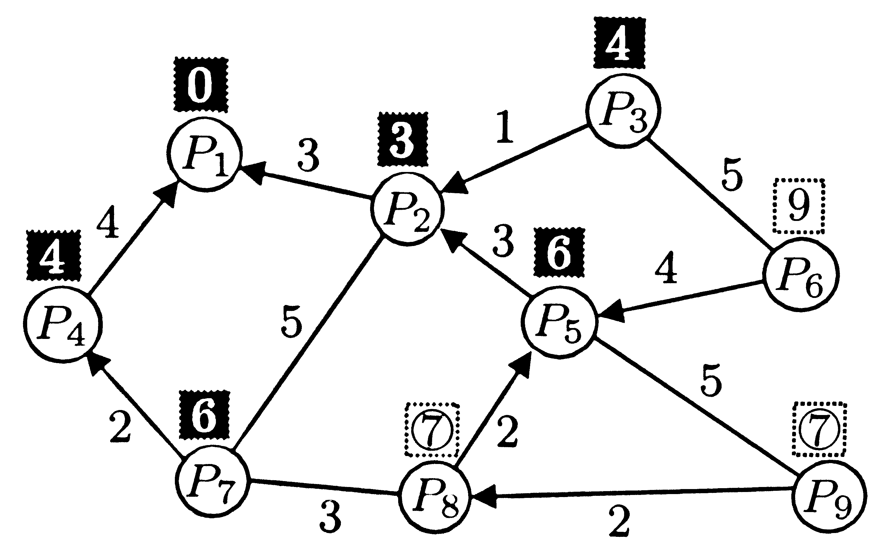
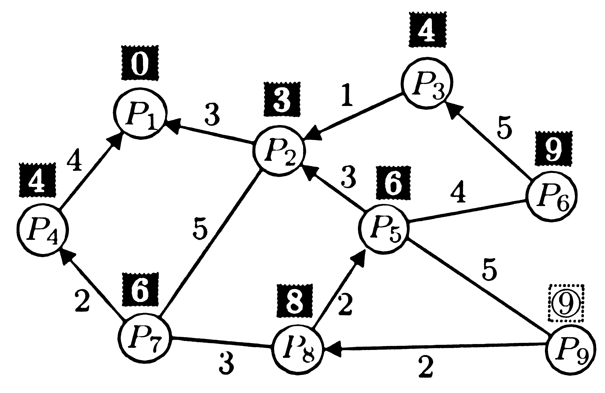
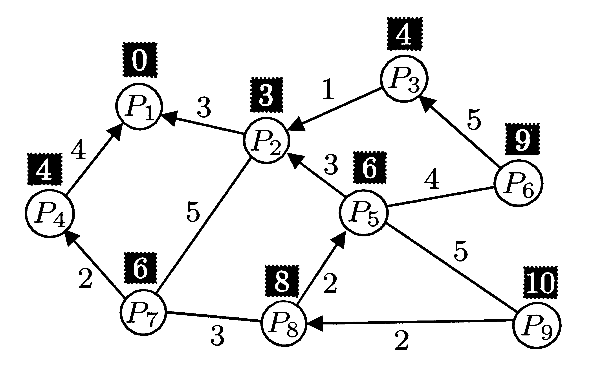

<!-- _class: title -->
<!-- paginate: true -->
# 適応的分散アルゴリズム 第７章 自己安定システム

川染翔吾

---
<!-- _class: title -->
# 7.1 自己安定システムの定義

---
# 自己安定アルゴリズム

### 定義 1
分散アルゴリズム $\mathcal{A}$ の任意の大域状態 $c_0$ から始まる任意の実行 $E = c_0, c_1, \dots$ において次の条件を満たす $c_i$ が現れるとき $\mathcal{A}$ を**自己安定アルゴリズム**と呼ぶ
- 大域状態 $c_i$ から始まる任意の実行 $E'=c_i,c'_{i+1},c'_{i+2},\dots$ は正当な実行である

この $c_i$ を $\mathcal{A}$ の**正当な大域状態**と呼ぶ

---
# 自己安定アルゴリズム

- どのような大域状態から実行しても、いずれ正しい動作に復帰する
- どれほど多数の一時故障に対しても耐故障性がある
- アルゴリズム実行中は、故障は存在せず、プロセスが正しく動作することを前提とする
    - 故障が起こった場合は、その状態を初期大域状態と見做せば、耐故障性を保証できる
- 性能は、安定時間（任意の大域状態から正当な大域状態に復帰するまでにかかる最大時間）や各プロセスが必要とする記憶領域などで評価される

---

<!-- _class: title -->
# 7.2 分散システムのモデル

---
# リンクレジスタ

- 通信リンクはリンクレジスタでモデル化する
- プロセス $P_i$ から $P_j$ への情報の伝達は、$P_i$ がレジスタ $R_{i,j}$ に書き込んだ情報を $P_j$ が $R_{i,j}$ から読み出すことによって行う

- 想定する初期大域状態の中には伝送中のメッセージが存在する場合もある

---
# スケジューラ
## 集中型デーモン　C-デーモン
- 全ての隣接プロセスからのレジスタを読み出し、状態遷移し、全ての隣接プロセスへのレジスタに書き込む一連の動作が 1 原子動作
- 複数のプロセスが同時に実行することはない
## 分散型デーモン　D-デーモン
- 全ての隣接プロセスからのレジスタを読み出し、状態遷移し、全ての隣接プロセスへのレジスタに書き込む一連の動作が 1 原子動作（C-デーモンと同じ）
- 複数のプロセスが同時に実行できる

---
## 読出し/書込みデーモン　R/W-デーモン
- 以下のいずれかの動作を 1 原子動作とする
    1. 一つの隣接プロセスからのレジスタを読み出して状態遷移する
    1. 一つの隣接プロセスへのレジスタに書き込んで状態遷移する
- 複数のプロセスが同時に実行することはない

---
# スケジューラ
- D-デーモンは、C-デーモンの同時実行しない制約を緩和したものであり、D-デーモンを想定して設計されたアルゴリズムは、C-デーモンでも正しく動作する

- R/W-デーモンは、C-デーモンの原子動作の粒度を細分したものであり、R/W-デーモンを想定して設計されたアルゴリズムは、C-デーモンでも正しく動作する

- D-デーモンで隣接プロセスが同時に実行すると、それぞれのプロセスは他方の状態遷移前の状態を読み出す

- R/W-デーモンでは複数プロセスの同時実行を許していないが、同時動作を許す場合に起こりうる実行と本質的に同じ実行が R/W-デーモンでも起こりうる

- R/W-デーモンを想定して設計されたアルゴリズムは、D-デーモンでも正しく動作する

---
# 非同期ラウンド
- 本章ではスケジューラの公平性を仮定する
    - どのプロセスもいずれかならず動作する
- 本章では非同期システムを扱うが、プロセスの動作速度について仮定を置かないために、時間計算量を評価できない
- **非同期ラウンド**：すべてのプロセスが 1 回以上原子動作を実行するまでを 1 ラウンドとする

---

<!-- _class: title -->
# 7.3 自己安定アルゴリズムの具体例

---
# 最短経路木構成

- 各リンクに正のコストが定まっている
- すべてのリンクは双方向通信可能
- 双方向のコストは等しい
- $P_1$ と他のすべてのプロセスとの間の最短経路を求める

---
# 最短経路木構成

- $P_1$ と他のすべてのプロセスとの間の最短経路から構成される木（最短経路木）を求める

---
# SS-SPT
- 各プロセス $P_i$ は変数 ${prnt}_i$ と ${dist}_i$ を持つ
- ${prnt}_i$：$P_1$ への最短経路での $P_i$ の次のプロセス
    - 最短経路木における $P_i$ の親
- ${dist}_i$：$P_i$ から $P_1$ への最短経路のコスト

- D-デーモンを仮定

---
# SS-SPT

### プロセス $P_1$ 上
1. `repeat` `forever`
1. &nbsp;&nbsp;&nbsp;&nbsp;${dist}_1\gets0$; ${prnt}_1\gets\bot$

### プロセス $P_i (i \ne 1)$ 上
1. `repeat` `forever`
1. &nbsp;&nbsp;&nbsp;&nbsp;$k$ を $P_k$ が $P_i$ の隣接プロセスの中で ${dist}_k + cost(i,k)$ が最小となるものとする
1. &nbsp;&nbsp;&nbsp;&nbsp;${dist}_i\gets{dist}_k + cost(i,k)$
1. &nbsp;&nbsp;&nbsp;&nbsp;${prnt}_i\gets P_k$

---
# SS-SPT
- 自己安定アルゴリズムでは終了状態はない
- Bellman-Fordの分散版
- $dist$ に書き込んだ値は隣接するリンクレジスタにも書き込む。これにより隣接プロセスはその変数を読み出せる
- Bellman-Fordでは距離の初期値を $\infty$ としてこれが小さくなっていくことで求まる
- 初期大域状態によっては $dist$ に最短経路より小さい値（**浮動コスト**）が格納されていることがある

---
# SS-SPTの実行例

---
# SS-SPTの実行例

---
# SS-SPTの実行例

---
# SS-SPTの実行例

---
# SS-SPTの実行例

---
# SS-SPTの実行例

---
# SS-SPT

- 安定時間は $O((C/c)n)$ 非同期ラウンド
    - $C$：ネットワーク中のリンクの最大コスト
    - $c$：ネットワーク中のリンクの最小コスト

### 証明

各プロセス $P_i$ は $R_{j,i}+cost(i,j)$ の最小値を ${dist}_i$ に代入する操作を繰り返すため、浮動コストの最小値は少なくとも $c$ ずつ増加する。
2プロセス間の距離は $C(n-1)$以下であるため、$\lceil(C/c)(n-1)\rceil+1$ 非同期ラウンド以内に浮動コストが存在しなくなる。

---
浮動コストが存在しなくなってから $n-1$ ラウンドで $P_1$ を根とする最短経路木が構成されることを示す。

プロセス $P_1$ については ${dist}_1 = 0$ が成立する。
最短経路木において、$P_1$ を親とする任意のプロセス $P_i$ は原子動作を実行すれば、${dist}_i$ に $P_1$ から $P_i$ への最短経路のコストを代入し、$P_1$ を $prnt_i$ に代入する。つまりレベル1までの最短経路木が構成される。この議論を繰り返すと $k$ ラウンド以内にレベル $k$ まで構成されることを示せる

---
# リーダ選挙
- プロセスはそれぞれ異なる識別子を持つ
- 最大の識別子をもつプロセスをリーダとして選出する

### 初期大域状態を仮定できる場合
${leader}_i$にリーダの識別子を格納する。すべての隣接プロセスから $leader$ を読出し、より大きいものがあれば更新する。

- 大きな偽識別子があった場合、それが選ばれてしまう

---
# SS-LEADER
1. `repeat` `forever`
1. &nbsp;&nbsp;&nbsp;&nbsp;${leader}_i\gets {ID}_i$
1. &nbsp;&nbsp;&nbsp;&nbsp;${dist}_i\gets 0$
1. &nbsp;&nbsp;&nbsp;&nbsp;`for` $j\gets \{j|P_jはP_iに隣接\}$
1. &nbsp;&nbsp;&nbsp;&nbsp;&nbsp;&nbsp;&nbsp;&nbsp;`if`${leader}_j>{leader}_i$ かつ ${dist}_j<N-1$
1. &nbsp;&nbsp;&nbsp;&nbsp;&nbsp;&nbsp;&nbsp;&nbsp;&nbsp;&nbsp;&nbsp;&nbsp;${leader}_i\gets {leader}_j$
1. &nbsp;&nbsp;&nbsp;&nbsp;&nbsp;&nbsp;&nbsp;&nbsp;&nbsp;&nbsp;&nbsp;&nbsp;${dist}_i\gets {dist}_j + 1$

---
# SS-LEADER
- $O(n)$ 非周期ラウンドで偽識別子がなくなる
- 根つき全域木が構成できる
