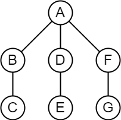

<!-- _class: title -->
<!-- paginate: true -->
# 適応的分散アルゴリズム 第７章 自己安定システム

川染翔吾

---
# トークン巡回
- $n$ 個のプロセス $P_0, P_1, \dots , P_{n-1}$ からなる単方向リング
    - プロセス $P_i$ はレジスタ $R_{i,(i+1)\mod n}$ のみに書込みが行え、レジスタ $R_{(i-1)\mod n,i}$ のみから読出しが行える
- 各プロセス $P_i$ の状態 ${st}_i$ を $0$ 以上 $K-1$ 以下の整数値で表す
    - ただし $K$ は $n$ 以上の任意の定数

### 正当な大域状態
${st}_0={st}_1=\dots={st}_{n-1}$：$P_0$ がトークンを持つ
${st}_0=\dots={st}_{i-1}={st}_{i}+1=\dots={st}_{n-1}+1 \mod K$：$P_i$ がトークンを持つ

---
# SS-TOKEN-RING
### プロセス $P_0$ 上
1. `repeat` `forever`
1. &nbsp;&nbsp;&nbsp;&nbsp;`if` ${st}_0={st}_{n-1}$ `then`
1. &nbsp;&nbsp;&nbsp;&nbsp;&nbsp;&nbsp;&nbsp;&nbsp;${st}_0 \gets {st}_0 + 1 \mod K$

### プロセス $P_i (i \ne 0)$ 上
1. `repeat` `forever`
1. &nbsp;&nbsp;&nbsp;&nbsp;`if` ${st}_i\ne{st}_{i-1}$ `then`
1. &nbsp;&nbsp;&nbsp;&nbsp;&nbsp;&nbsp;&nbsp;&nbsp;${st}_i \gets {st}_{i-1}$

---
# SS-TOKEN-RING
SS-TOKEN-RING の安定時間は $O(n)$ 非同期ラウンドである
### 証明
<!-- 任意の初期大域状態から正当な大域状態に到達することを示す。 -->
<!-- $P_i (1\le i\le n-1)$ の状態 ${st}_i$ が変化するのは ${st}_i\gets{st}_{i-1}$ が実行されるときだけであるため、$P_i (1\le i\le n-1)$ が状態を変化させることによってシステム中に存在しない状態が新たに現れることはない。  -->
- ${st}_0 = {st}_i$ となるプロセス $P_i (1\le i\le n-1)$ が存在しない場合
${st}_0$ の値が伝搬して ${st}_0={st}_1=\dots={st}_{n-1}$ となるまで $P_0$ は動作できない。したがって、$n$ ラウンド以内に正当な大域状態に到達する。

- ${st}_0 = {st}_i = s_0$ となるプロセス $P_i (1\le i\le n-1)$ が存在する場合
$P_0$ が ${st}_0\gets s_0+1 (=s_1)$ を実行することがある。このとき ${st}_i = s_1$ なるプロセスが存在する場合、はじめから ${st}_i = s_1$ が存在していたことになる。このように、$P_i$ が持つ状態が $P_{n-1}$ まで伝搬することにとって、$P_0$ が実行可能な ${st}_0\gets {st}_0 + 1$ をすべて実行し終えた状態に $n$ ラウンド以内に到達する。

---
# 任意のネットワーク上のトークン巡回

- **オイラーツアー**を用いて、木にリングを埋め込む
- ツアーの長さは $2(n-1)$

---
# 任意のネットワーク上のトークン巡回

- 木の各プロセスがリングの一つのプロセスに対応するように埋め込む
- 深さが偶数のプロセスは最初に表れるもの、深さが奇数のプロセスは最後に現れるものを残す
- リング上で隣接するプロセスの距離は高々 $3$

---
# 任意のネットワーク上のトークン巡回

- リング上で隣接するプロセスの最大距離が $2$ 以下になるような埋込みは存在しない

右のグラフで最大距離が 2 以下になる埋込みを考える
C の前後には A と B がくるはず
E, G についても同様だから A の前後に C, E, G があることになり矛盾

---
<!-- _class: title -->
# 7.4 自己安定アルゴリズムの合成

---
# 自己安定アルゴリズムの合成
### 定義
次の条件を満たす自己安定アルゴリズム $A1$ と $A2$ の動作を 1 ステップずつ交互に実行することを**公平な実行**という
- $A1$ は $A2$ の動作の影響を受けず、$A2$ と独立に動作する。
    - $A2$ は $A1$ の変数に対する書込みを実行せず、$A1$ は $A2$ の変数に対する読出しも書込みも実行しない
- $A2$ は $A1$ が求めた解を利用して動作する。
    - $A2$ は $A1$ の変数を読み出すことができる

---
# 自己安定アルゴリズムの合成
$A1$ を問題 $\Pi1$ を解く自己安定アルゴリズムとし、$A2$ を問題 $\Pi1$ が解かれていることを前提に問題 $\Pi2$ を解く自己安定アルゴリズムとする。
アルゴリズム $A1$, $A2$ の公平な合成は、問題 $\Pi2$ を解く自己安定アルゴリズムである

---
# 自己安定アルゴリズムの合成

---
<!-- _class: title -->
# 7.5 自己安定化コンパイラ

---
# フィードバックのある情報伝達
- 根付き木で、根が情報伝達を行い、他のすべてのプロセスからフィードバックを集める
- 情報伝達フェーズのプロセスとフィードバックフェーズのプロセスが混在することがある

---
# 自己安定化コンパイラ
自己安定性を有しない分散アルゴリズム $A$ に自己安定性を持たせることは、次の二つの分散アルゴリズムの組み合わせで実現できる

1. **モニタアルゴリズム**：自己安定性を有しない分散アルゴリズム $A$ をモニタする（大域状態を繰返し求める）
1. **リセットアルゴリズム**：モニタアルゴリズムが分散アルゴリズム $A$ の大域状態に矛盾を発見したときに、$A$ をリセットして、あらかじめ決められた初期大域状態から $A$ を再実行する

それぞれのアルゴリズムについても自己安定性を有している必要がある

---
# 自己安定モニタ
- 根付き全域木を構成し、根を $P_0$ とする

- $P_0$ はアルゴリズム $A$ の局所状態を局所スナップショットとして記録し、終了フラグを ${true}$ に設定する。
すべての隣接プロセスに局所スナップショットを要求する（リンクレジスタに開始要求を書き込む）ことでスナップショットを起動する
- $P_i (1\le i \le n-1)$ は $P_i$ に隣接するすべてのリンクレジスタを読出し、初めて開始要求を読み出したとき、そのときの $A$ の局所状態を局所スナップショットとして記録し、終了フラグを ${true}$ に設定する。
- すべてのスナップショットを 7.3.4 フィードバックのある情報伝達 のアルゴリズム SS-PIF を実行し収集し、完了すると、SS-PIF ですべてのプロセスの終了フラグを ${false}$ にする

---
# 自己安定リセット
- 自己安定モニタで求めた大域状態が、初期大域状態から到達可能か判定し、到達不能なら SS-PIF で初期化する
- SS-PIF を再度起動し、Aの実行開始を要求する
